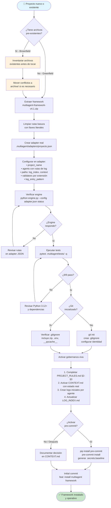
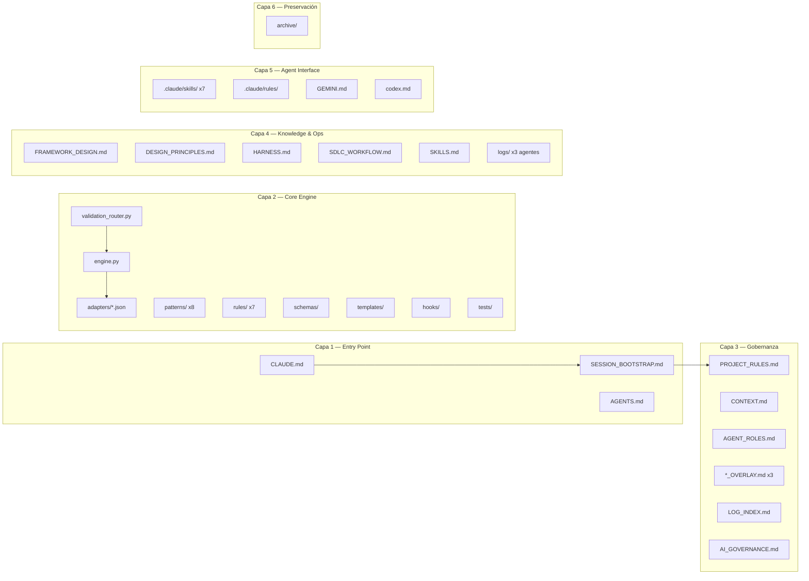
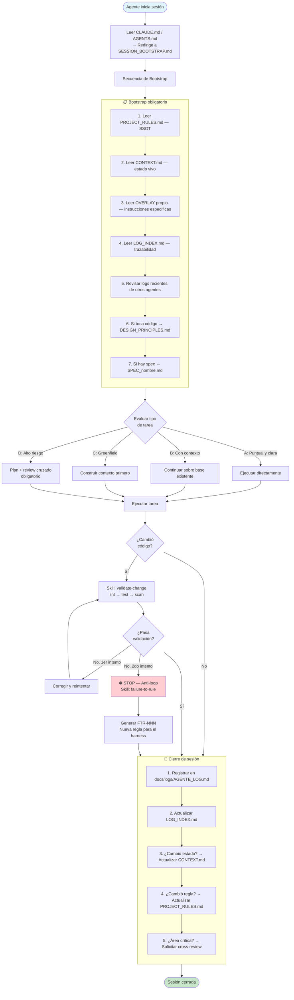
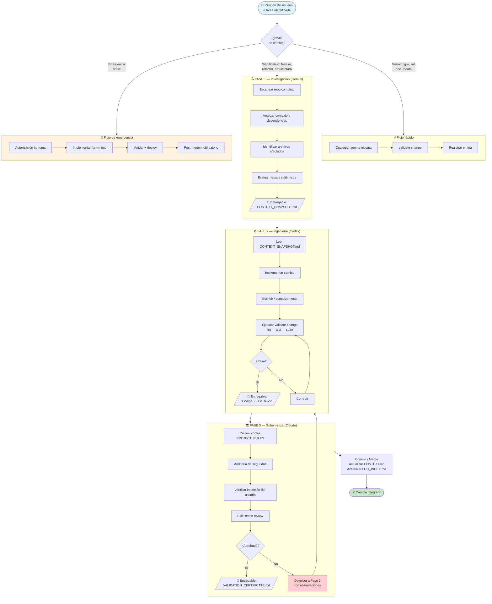
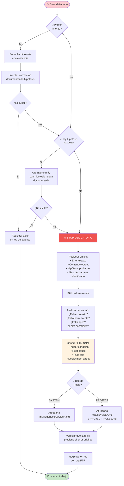
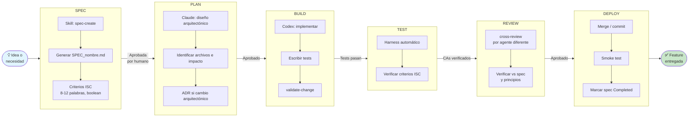
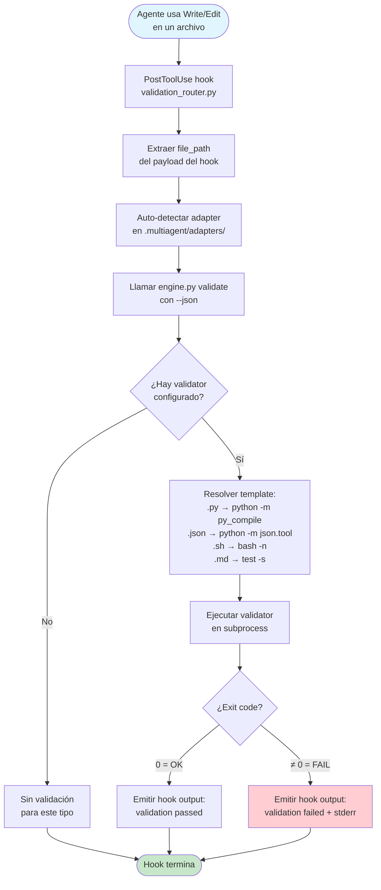
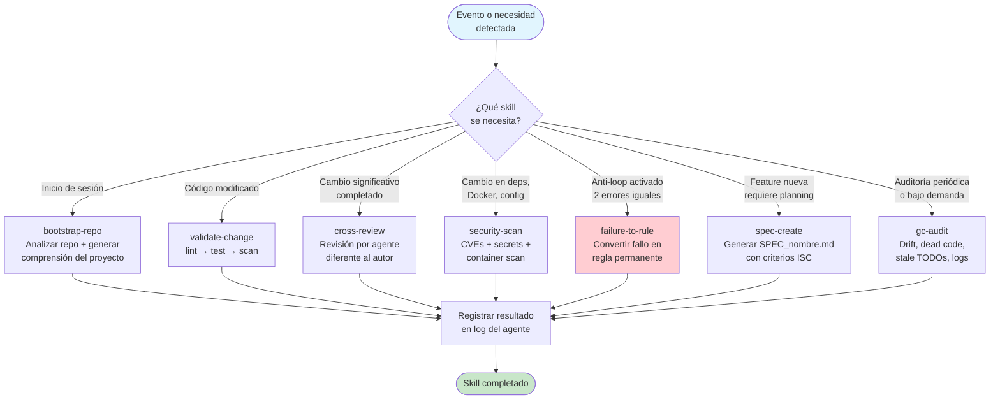
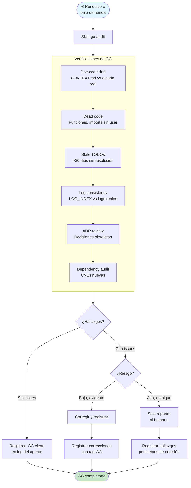
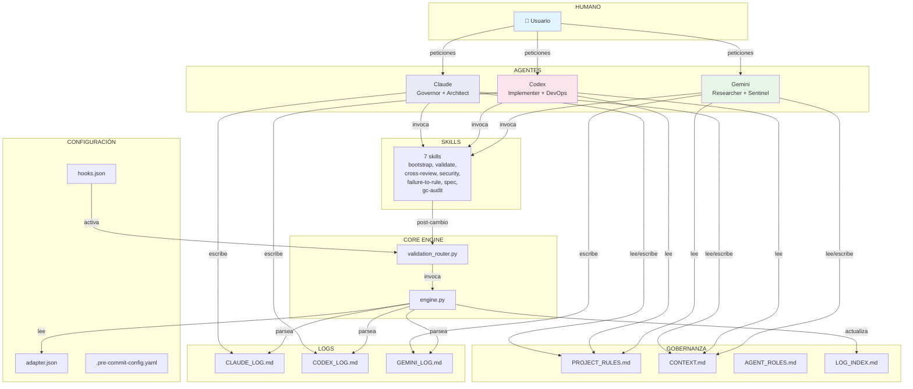

# FLOW_DIAGRAMS.md — Diagramas de Flujo del Framework

> **Versión:** 1.0
> **Fecha:** 2026-03-16
> **Autor:** Claude Opus 4.6 (Governor / Architect)
> **Formato:** Mermaid (renderizable en GitHub, GitLab, VS Code)
>
> Dos perspectivas: **Implementación** (instalar el framework en un proyecto)
> y **Uso** (operar con el framework ya instalado).

---

## PARTE A — IMPLEMENTACIÓN (Instalar el framework en un proyecto nuevo)

### A1. Flujo maestro de implementación



### A2. Estructura de archivos resultante



---

## PARTE B — USO (Operar con el framework ya instalado)

### B1. Ciclo de vida de una sesión de agente



### B2. Pipeline Tri-Agente (cambios significativos)



### B3. Flujo de manejo de errores y anti-loop



### B4. Flujo del SDLC completo



### B5. Flujo de validación post-cambio (validation_router.py)



### B6. Flujo de activación de skills



### B7. Flujo de garbage collection



---

## PARTE C — MAPA DE INTERACCIÓN ENTRE COMPONENTES

### C1. Vista general del sistema



---

## Apéndice — Referencia rápida de comandos del engine

```bash
# Ver estado de todos los agentes
python .multiagent/core/engine.py --config .multiagent/adapters/framework-multiagent.json status

# Generar propuesta de actualización de LOG_INDEX
python .multiagent/core/engine.py --config .multiagent/adapters/framework-multiagent.json sync-index

# Escribir actualización directamente (requiere anchors en LOG_INDEX.md)
python .multiagent/core/engine.py --config .multiagent/adapters/framework-multiagent.json sync-index --write

# Sugerir validador para un archivo
python .multiagent/core/engine.py --config .multiagent/adapters/framework-multiagent.json validate path/to/file.py

# Mismo en formato JSON (para hooks)
python .multiagent/core/engine.py --config .multiagent/adapters/framework-multiagent.json --json validate path/to/file.py
```

---

*Documento generado por Claude Opus 4.6 (Governor / Architect) — 2026-03-16*
*Basado en análisis de engine.py, validation_router.py, 7 skills, 8 patterns, SDLC workflow y hooks*
